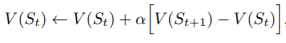

# Table of Contents
- [Table of Contents](#table-of-contents)
- [What is Reinforcement Learning?](#what-is-reinforcement-learning)
  - [Brief introduction](#brief-introduction)
  - [Supervised, Unsupervised or Neither?](#supervised-unsupervised-or-neither)
  - [Markov Decision Processes](#markov-decision-processes)
- [Features](#features)
  - [Generality & Practicality](#generality--practicality)
  - [Interactions with engineering and scientific disciplines](#interactions-with-engineering-and-scientific-disciplines)
- [4 main sub-elements](#4-main-sub-elements)
  - [Policy](#policy)
  - [Reward Signal](#reward-signal)
  - [Value function](#value-function)
  - [Environment model](#environment-model)
- [Challenges](#challenges)
  - [Exploration v Exploitation](#exploration-v-exploitation)
- [Evolutionary methods](#evolutionary-methods)
  - [Evolutionary or Reinforcement Learning?](#evolutionary-or-reinforcement-learning)
    - [Policy evaluation & Updating](#policy-evaluation--updating)
    - [Example: Tic-Tac-Toe](#example-tic-tac-toe)
  - [#### **Evolutionary Method**](#-evolutionary-method)
  - [#### **Reinforcement Learning**](#-reinforcement-learning)

# What is Reinforcement Learning?

## Brief introduction

In itself, Reinforcement Learning is simultaneously a problem, a class of solution methods that would work well on the problem and the field that studies said problem and solution methods.

Reinforcement Learning relies heavily on the concept of the state whether it be as input to the policy and value function or as both input and output to and from the model. 

It is a computational approach to learning from interaction that relies heavily on the formal framework of the Markov decision processes whereby the end goal is to maximise the numerical reward the agent receives and is much more focused on goal-directed learning from interaction as compared to other approaches to machine learning such as Neural Networks.

Like other approaches to machine learning, there are many layers to reinforcement learning. The simplest of cases are those whereby actions only directly affect the reward obtained at that point in time. However, if the agent is to be applied in a real-world scenario, it is accepted that actions at one point in time have an impact on the future. 

As such, trial-and-error search ( referring to exploration by the agent to determine the optimal action given a particular environment ) and delayed reward are some of the most important distinguishing features of Reinforcement Learning.

## Supervised, Unsupervised or Neither?

Reinforcement learning cannot be strictly classified as a Supervised or Unsupervised Machine Learning Problem. 

Supervised Learning refers to learning from a training set of labeled examples whereby there is a provided definite answer from the beginning. On the other hand, Unsupervised Learning refers to finding a structure or a pattern hidden within unlabelled data.

In Reinforcement Learning, the agent is not told which actions to take but instead discovers for itself which actions would yield the most reward through exploration. While finding a set pattern or structure could be useful in some Reinforcement Learning problems, this is not the end goal.

## Markov Decision Processes

The problem of Reinforcement Learning can be formalised using ideas from dynamical systems theory, more specifically, the optimal control of incompletely-known Markov Decision Processes.

More information can be found in [Chapter 3](../chap3) but the general idea is to simply capture the most important aspects of the real-world problem facing the learning agent as it interacts over time with its environment.

This framework is intended to be a simple way to represent these important features / aspects of the problem, which are:
1. Sensation
    - The learning agent must, to a certain extent, be able to sense the state of its environment
2. Action
    - The learning agent must be able to take actions that affect its current state
3. Goal
    - The learning agent must have a goal, or goals, related to its environment.

# Features

## Generality & Practicality

Unlike other more conventional Machine Learning approaches, Reinforcement Learning explicity considers the whole problem of a goal-directed agent that interacts with an uncertain environment.

All agents have explicitly stated goals, actions that they can take, and are able to sense as well as interact with their environment. Additionally, from the beginning, there is a large amount of uncertainty facing agents as it tries to perform the 'best' actions.

Additionally, unlike in other Machine Learning approaches where each model focuses on a single sub-problem with no regard for how it can be used in real-world scenarios and real-time decision making, when sub-problems are addressed in Reinforcement Learning, they are problems that play clear roles in complete, interactive, goal-seeking agents.

Complete, interactive, goal-seeking agents can either refer to a complete robot / organism by itself or a component of a larger system. 

For example, an agent that monitors the charge level of a robot's battery and sends commands to the robot's control architecture. In such a case, the agent is a single part of a larger system, the robot, and its environment would refer to the entirety of the robot as well as said robot's environment.

## Interactions with engineering and scientific disciplines

Reinforcement Learning is part of a decades-long trend within AI and ML toward greater integration with mathematical subjects such as Statistics. One example is the classical "curse of dimensionality" problem in operations research, control theory and just classical Machine Learning. 

Reinforcement Learning has also interacted strongly with many scientific disciplines, most prominently, Psychology and Neuroscience. This seems fairly obvious as Reinforcement Learning is the discipline of AI that has the most correlation with animals and humans, biological organisms in other words. Many core algorithms of Reinforcement Learning were also originally inspired by biological learning systems. 

# 4 main sub-elements

## Policy

A policy is the core of an agent as it defines the agent's way of behaving at a given time. Think of it as a rule, or a set of rules, that helps the agent determine the best action to take at a particular time step. 

Roughly speaking, back in the context of Reinforcement Learning, a policy is a mapping from perceived states of the environment to actions that should or could be taken when in such a state. 

A policy can either be a simple function or lookup table, or in more complex cases, may involve an extensive computation such as a search process. In most cases, a policy would be stochastic, specifying the probabilities for each action. ( Think softmax activation functions )

## Reward Signal

A reward signal defines the goal of a Reinforcement Learning problem. It determines the immediate, intrinsic desirability of environment states.

It is the primary basis for altering the policy depending on the reward given for a particular action selected by the policy. If an action resulted in little reward, the policy would be altered such that it would select other actions instead.

With each time step, the agent receives a reward signal from the environment with a single number denoting the reward. As the agent's sole objective is to maximise the total reward it receives, this reward signal thus defines the good and bad events for an agent.

In most cases, the reward signal would be a stochastic function of the state of the environment and the action taken.

## Value function

A reward signal indicates good and bad events at the immediate time step however, the value function indicates what is good in the long run.

Roughly speaking, the value of a state refers to the total amount of reward an agent can expect to accumulate until the end of the run, starting from that specific state.

In contrast to rewards, values indicate the long-term desirability of states after taking into account the likely following states and rewards available in said states.

While rewards are Primary, in the sense that without rewards, there are no values and the purpose of values is to achieve more rewards, values are debatably more important than actions when making and evaluating decisions.

The usage of such a value function distinguishes Reinforcement Learning from [evolutionary methods](#evolutionary-methods).

However, the challenge then comes in obtaining the most accurate estimation of the value functions of each state given that we are unable to determine the reward signal for each future state.

## Environment model

It is important to first note that an environment model is not the same as the environment itself.

An environment model mimics the behavious of the environment, or more generally, allows inferences to be made about how the environment will behave in a given state and action for a particular time step.

However, environment models are optional and methods that utilise models, usually for planning, referring to attempting to decide on a course of action by considering possible future states, are called Model-based methods.

# Challenges

## Exploration v Exploitation

At the start, the agent has no idea as to which actions would lead to the greatest amount of reward. As such, the agent would have to **explore** its environment and the different actions it can take so as to make better action selections in the future. However, a key part of Reinforcement Learning is for the agent to **exploit** what it has already discovered in order to obtain the maxima reward.

Thus, we can see the dilemma here. The agent can neither pursue exploration or exploitation exclusively as it may either miss actions that could result in a larger reward if it exploits exclusively or not be able to obtain the maxima reward if the agent explores the environment too much. Therefore, the problem is as such: 

*How do we ensure that the agent both tries a variety of tasks as well as progressively favour actions that result in a larger reward and thus appears best?*

---

The chapter doesn't really continue to go into this problem however, one way that I can think of off the top of my head would be to adjust how much the agent explores or exploits as it trains more.

I.e. if say at the start, we give the agent a 100% chance of exploring, we can slowly decrease this percentage over time. For example, decreasing by 1% for every 1000 time steps. 

But, this leads us to another problem. How do we determine what percentage to decrease by and for how many time steps? The agent could learn faster or learn slower depending on the environment and task..

# Evolutionary methods 

Evolutionary methods are a type of Reinforcement Learning that does not involve estimating value functions by searching directly in a policy space, guided by evaluations of entire policies.

It works by applying multiple static policies that each interact with a separate instance of the environment over an extended period of time.

An analogous way of looking at evolutionary methods is to compare it to biological evolution in organisms. Even if an organism does not learn in its lifetime, the species as a whole evolves after hundreds of thousands of lifetimes.

Evolutionary methods are effective in certain scenarios:
1. If the policy space is sufficiently small, or
2. The policy space can be structured such that good policies are easily located, or
3. There is a lot of time available for the search

## Evolutionary or Reinforcement Learning?

If the agent is unable to sense the entirety of the environment it is in, evolutionary methods have an advantage over Reinforcement Learning.

The problem of Evolutionary methods lie in the fact that Evolutionary methods ignore much of the useful structure of Reinforcement Learning. 

Evolutionary methods do not make use of the fact that each policy is actually a function from states to actions and do not keep track of the various states and actions previously taken during the agent's lifetime.

### Policy evaluation & Updating

Like that of Reinforcement Learning methods, Evolutionary methods also make use of policies to decide which action to take in a given state.

The difference however, comes in the fact that Evolutionary methods utilises a fixed policy as it plays multiple games and determines the usefulness of the policy based on the number of times the goal is reached, meaning that only the final outcome matters. Afterwards, another policy is selected and the model repeats the above steps.

In contrast, in Reinforcement Learning, each individual state is evaluated and the policy is updated with every time step.

### Example: Tic-Tac-Toe

#### **Evolutionary Method**
---
An evolutionary method applied to this problem would directly search the space for each possible policy, in this context, a rule that tells the player what move to make for each different state, and select the one with the highest probability of winning.

An estimate of this probability would first be obtained via playing multiple games against an opponent and evaluating the state of the board at each move made by either the opponent or the player itself. 

#### **Reinforcement Learning**
---
A Reinforcement Learning method applied to this problem would be approached first set up a table of numbers, representing each possible state of the game with each number indicating the latest estimate ( value ) of the probability of the agent winning the game if that particular state is reached.

Then, similarly to Evolutionary Methods, the agent plays multiple hames against an opponent. The policy in this case however, would be to select the move that would result in the state with the highest value, i.e. for the agent to move greedily ( exploitation ).

However, the agent can also occasionally explore in order to allow the agent to experience a larger variety of states that it might otherwise never see if it always moves greedily. 

As the agent selects an action, the value of its previous state is then updated and increasingly gets closer to the value of the next state.

