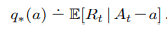
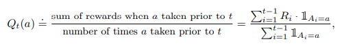
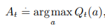
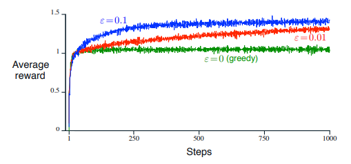
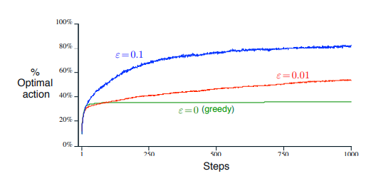

# Table of Contents

- [Table of Contents](#table-of-contents)
- [k-armed Bandit Problem](#k-armed-bandit-problem)
- [Action-value Methods](#action-value-methods)
  - [Sample-average Method](#sample-average-method)
  - [Action Selection Rule](#action-selection-rule)
    - [Greedy Selection (Exploitation)](#greedy-selection-exploitation)
    - [Near-greedy Selection (Exploitation & Exploration)](#near-greedy-selection-exploitation--exploration)
- [10-armed Testbed](#10-armed-testbed)
  - [Greedy v. Near-greedy](#greedy-v-near-greedy)
    - [Average Reward](#average-reward)
    - [Discovery, and usage, of Optimal Action](#discovery-and-usage-of-optimal-action)
    - [When to use greedy or near-greedy?](#when-to-use-greedy-or-near-greedy)

# k-armed Bandit Problem

Reduced to its simplest form, the k-armed Bandit Problem refers to a learning problem whereby the agent is faced repeatedly with *k* different possible actions whereby it has to choose one to perform. Afterwhich, it then obtains a numerical reward, that is chosen from a stationary probabiliti distributions, depending on the action chosen. The objective, like most other learning problems in Reinforcement Learning, is therefore to maximise the expected total reward over a time period.

An analogous way to look at it is also to imagine a doctor who has to prescribe different experimental treatments to a series of ill patients. In such a case, an action refers to the selection of a treatment and the reward refers to how well the patient responded to said treatment.

Today, the term "Bandit Problem" is sometimes used as a generalisation of the problem as we described above. All references to a Bandit Problem will, unless otherwise stated, refer to the following case (Take note of the following notations):

Each *k* action has an expected or mean reward, which will be called the *value* of the action that corresponds to it. The action selected on a particular timestep, *t* will be referred to as *At* and the corresponding reward as *Rt*. The estimated reward of an action *a* at a particular timestep *t* is also denoted as *Qt(a)* where the closer *Qt(a)* is to *q\*(a)*, the better.

The value then of an arbitrary action *a*, denoted as *q\*(a)*, is the expected reward given that *a* is selected:

# Action-value Methods

Action-value Methods are the collective name for estimating the values of actions and using said values to make action selection decisions.

The simplest, and most instinctive way, to estimate the values of actions is by averaging the rewards actually received, i.e. taking the mean of the sum of rewards when *a* was taken previously, prior to the current timestep *t*. This is also called the Sample-average Method.

## Sample-average Method

The Sample-average Method got its name from the fact that each estimate is an average of the sample of relevant rewards. The formula is as follows:

If the denominator is 0, i.e. *a* has never been selected prior to this, then we define *Qt(a)* as some default value, such as 0. Conversely, as the denominator approaches infinity then, by the law of large numbers, *Qt(a)* converges to *q*(a)*.

Of course, this is merely one of the simplest estimation method and it is not necessarily the best one.

## Action Selection Rule

An action selection rule refers to, as its name suggests, a rule that helps the agent decide which action to take out of the *k* different options.

### Greedy Selection (Exploitation)

The simplest rule is, as expected, to merely select the action with the highest estimated value. Essentially, to move greedily.

If there is more than one greedy action, meaning that maybe two or more actions have the same *Qt(a)*, then a selection is made, usually arbitrarily, between all the greedy actions.

Regardless, greedy action selection always **exploits** the current knowledge that an agent may have in order to maximise its immediate reward. Little time is afforded to sampling apparently inferior actions, **exploring** if you will, even if they may lead to better states with larger state value functions.

### Near-greedy Selection (Exploitation & Exploration)

A simple improvement to a greedy action selection would be to set a small probability, *&epsilon;*, that will in a way, change the selection rule at that timestep to instead select randomly from among all actions independent of any action-value estimates.

Methods using the Near-greedy selection rule can also be referred to as *&epsilon;-greedy methods*.

An advantage of this selection method is that, as the number of steps increases and approaches the limit, every action will be sampled an infinite number of times which ensures that all *Qt(a)* converges to their respective *q\*(a)* which in turn implies that the probability of selecting the optimal action converges to greater than 1-*&epsilon;*, that is, near certainty.

In layman's terms, this means that seeing as we sample each action a near infinite number of times, we obtain a better and better estimate of the value of each action and thus, we can say with greater and greater certainty that we are choosing the most optimal action every time as we know the true values of each action at each timestep.

# 10-armed Testbed

The 10-armed Testbed is another name to refer to a suite of test tasks, with *k* = 10 different possible actions for a set of *n* randomly generated k-armed Bandit Problems. 

In the case of this chapter, *n* = 2000 and the actual reward, *Rt*,was selected from a normal distribution with mean *q\*(At)* and variance 1.

This suite of test tasks can be used to measure the performance and behaviour of any learning method as it improves over time. Repeating this for multiple independent runs provides us with the measures of said learning algorithm's average behaviour on the problem.

## Greedy v. Near-greedy

### Average Reward

The below graph shows the increase in the expected reward the Reinforcement Learning agent receives as it gains more experience, i.e. as the number of timesteps increases.

All three methods seem to improve at roughly the same rate in the beginnning. However, the greedy method leveled off earlier at a lower level of about 1 reward-per-timestep, about 0.5 below the best possible reward on this testbed, as compared to the other two near-greedy methods which continued to improve.

In the long run, the greedy method performs significantly worse than the near-greedy methods. As we have already learned thus far, we can probably attribute this to the fact that the agent gets stuck performing sub-optimal actions as it does not explore other possible actions.

### Discovery, and usage, of Optimal Action

The below graph shows the percentage of times the Reinforcement Learning agent selected the optimal action as it gains more experience.

As expected, the near-greedy methods also performed better here in the long run as it continued to explore and thus, has a larger probability of discovering, as well as recognising, the optimal action.

While the greedy method did manage to select the optimal action, it only does so about one-thirds of the time and selected other, less optimal actions the other two-thirds of the time.

In contrast, the near-greedy methods select the optimal action more frequently, although not more than about 90% of the time.

If we compare the two near-greedy methods, while the *&epsilon;* = 0.1 method improves more quickly than the *&epsilon;* = 0.01 method, it also slows down soon after about the 500<super>th</super> timestep whereas the *&epsilon;* = 0.01 method continues to improve.

This does suggest that a good way to set the *&epsilon;* value would be to have a larger *&epsilon;* value in the beginning and slowly decreasing it. This would thus allow us to both discover the optimal action faster as well as to ensure that the Reinforcement Learning agent continues to select said optimal action with a larger probability.

### When to use greedy or near-greedy?

As with all things, it is not true that a certain method, in this case the near-greedy method, would always perform better than another method, the greedy method. In order to determine which method to use, we always have to look at the task at hand.

An easy way to decide whether to use the greedy or the near-greedy method is to look at the reward variance.

If there are noisy rewards, i.e. there is a large reward variance, it would take more exploration to find the optimal action and near-greedy methods would perform better than greedy methods.

However, if there is no noise at all, i.e. the reward variance is 0, the greedy method would perform better than the near-greedy method simply because it would discover the optimal action faster and it does not waste time exploring.

Of course, this scenario is created under the assumption that the problem is stationary, i.e. the true value of a particular action will not change over time. 

If the problem is non-stationary, then exploration would always be required, if simply to make sure that a previously sub-optimal action does not become more optimal.