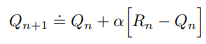
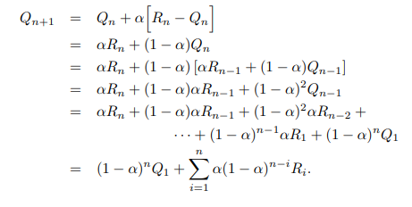

# Table of Contents

- [Table of Contents](#table-of-contents)
- [Introduction](#introduction)
- [Tracking Non-stationary Problems](#tracking-non-stationary-problems)
  - [Constant step-size parameter](#constant-step-size-parameter)

# Introduction

In the first part of this chapter, we went through different action-value methods and action selection rules that we can apply to a stationary problem to ensure that our Reinforcement Learning agent is able to reach its goal effectively. However, most real-world problems are not stationary and as such, if we want to learn how Reinforcement Learning can actually be applied in a real-world scenario, we have to know how to deal with non-stationary problems.

# Tracking Non-stationary Problems

When dealing with non-stationary problems, we should give more weight to recent rewards rather than long-past rewards. This will thus allow us to get a better understanding of the current true value of the reward of each action for each timestep.

One of the most popular ways to do this is to use a constant step-size parameter.

## Constant step-size parameter

*Take note that the step-size parameter &alpha; &#8712; (0,1] is constant* 

This also results in *Qn+1* being a weighted average of past rewards and the initial estimate *Q1*

From this formula, we can observe a number of things.
1. The sum of the weights = 1, hence the name weighted average
2. *1 - &alpha;* < 1. Thus, the weight given to *Ri* decreases as the number of intervening rewards increases. This is also called an *exponential recency-weighted average*.

However, also take note that in order for us to assume convergence for the true action values with a probability of 1, the following conditions have to be met:

1<super>st</super> Condition: This is to guarantee that the steps are large enough to eventually overcome any initial conditions / random fluctuations
2<super>nd</super> Condition: This is to guarantee that the steps eventually become small enough to assure convergence with probability 1

However, sequences of step-size parameters that actually meet these conditions often converge slowly and/or require a considerable amount of tuning so as to obtain a satisfactory convergence rate. Therefore, such sequences are usually used in theorectical work but not so much in actual applications and empirical research.